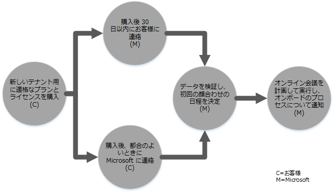
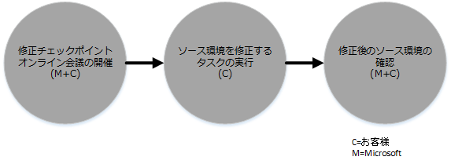
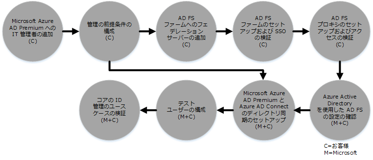

# Azure Active Directory Premium 用の FastTrack センター特典プロセス 
組織が Microsoft Azure AD Premium 用 FastTrack センター特典の対象である場合は、遠隔地の Microsoft のスペシャリストと一緒に Microsoft Azure AD Premium 環境を使い始められるように整えることができます。 自分の組織がこの特典の対象であるかどうかを確認するには、「[Azure Active Directory Premium 用の FastTrack センター特典](../Topic/FastTrack_Center_Benefit_for_Azure_Active_Directory_Premium.md)」をご覧ください。

この記事には以下が含まれています。

-   [Overview of the onboarding process](#overview)

-   [Expectations for your source environment](#expectations_src_environ)

-   [Phases of the onboarding process](#phases_onboarding_process)

-   各フェーズの [Microsoft responsibilities](#microsoft_responsibilities)

-   各フェーズの [Your responsibilities](#your_responsibilities)

オンボーディングを終えると、次のような状態になっているはずです。

-   Microsoft Azure AD Premium テナントが作成されている。

-   ライセンスを持つユーザーが、以下のいずれかの ID オプションを使用して Microsoft Azure AD Premium サービスにアクセスできる。

    -   クラウド ID (固有の Microsoft Azure AD Premium アカウント)。

    -   同期された ID: Active Directory フォレストを 1 つまたは複数お持ちのお客様に対して Azure Active Directory Connect (Azure AD Connect) ツールでオンプレミスの Active Directory から同期された Microsoft Azure AD Premium アカウント。

    -   フェデレーション ID -- Microsoft Azure AD Premium アカウントが次に該当する場合:

        -   Active Directory フォレスト構成を 1 つ所有するお客様に対して Microsoft Azure Active Directory Connect ツールで Active Directory から同期されている。

        -   オンプレミス Active Directory から Active Directory フェデレーション サービス (AD FS) 2.0 によりフェデレーションされている。

## オンボーディング プロセスの概要
オンボーディングには 2 つの主な構成要素があります。

-   **コア機能** - テナント構成と Azure AD の統合 (必要な場合) に必要なタスク。 コア機能は、他の Microsoft Online の対象サービスのオンボーディングのベースラインも提供します。

-   **サービス オンボーディング** - Microsoft Azure AD Premium スタンドアロンの構成に必要な、あるいは Azure AD Connect ディレクトリ同期または AD FS が伴うタスク。

次の図に、FastTrack センター特典を使用する場合のタイムラインを示します。

基本のプロセスは次のようになっています。

-   Microsoft は、対象となるプランの購入日から 30 日以内にお客様にご連絡します。 これらのサービスを組織で展開する準備ができている場合は、[FastTrack センター](http://fasttrack.microsoft.com/)からサポートをご依頼いただくこともできます。 サポートを依頼するには、FastTrack センター (http://fasttrack.microsoft.com) にサインインしてダッシュ ボードを開き、会社名を選択して [プラン] タブをクリックし、対象サービスのサポート依頼ボタンをクリックしてください。 オンボーディング サポートが開始したなら、オンライン会議のスケジュールを立てることになります。

-   Microsoft チームはコア機能に関して各種のお手伝いをし、その後対象のサービスごとに 1 回オンボーディングを行います。

すべてのオンボーディング サポートは Microsoft の専任担当者から遠隔で提供されます。

-   Microsoft は、ツール、説明書、およびガイダンスを組み合わせて使用したさまざまなオンボーディング活動でお客様を遠隔から支援します。 特定の構成タスクを Microsoft にまかせる場合、そのタスクを実行するためのアクセス許可を Microsoft に提供するように選択してください。

-   オンボーディング サポートは FastTrack センターによって提供され、所定地域の通常業務時間内にご利用いただけます。

-   オンボーディング サポートは、繁体中国語、英語、フランス語、ドイツ語、イタリア語、日本語、ポルトガル語 (ブラジル)、またはスペイン語で利用可能です。

-   Microsoft チームはお客様またはお客様の担当者と直接一緒に作業します。

## ソース環境の要件
1 つのコンソールから豊富な機能を持つ ID 管理を活用するために Microsoft Azure AD Premium と統合する、オンプレミスの Microsoft Active Directory を既にソース環境に用意していることでしょう。 FastTrack センター特典には、既存のオンプレミス実装と Microsoft Azure AD Premium の統合に関する支援が含まれます。 統合が必要な場合、お客様のソース環境が対象のアプリケーションに必要な最低要件を満たしている必要があります。

次の表に、オンボーディングで既存のソース環境に必要とされる要件を示します。

|アクティビティ|ソース環境要件|
|-----------|-----------|
|コア機能|以下のフォレスト構成で、機能フォレスト レベルが Windows Server 2008 以降に設定された Active Directory フォレスト。  -   1 つの Active Directory フォレスト -   複数の Active Directory フォレスト **Note:** フォレストが複数あるすべての構成において、AD FS の展開は FastTrack センター特典の対象外です。|
|サービス オンボーディング  -   Microsoft Azure AD Premium|Azure AD Premium にオンプレミスの Active Directory と環境が用意されています。これには、Azure AD と Azure AD Premium の機能の統合を妨げる特定された問題の修復も含まれます。|

## オンボーディング プロセスのフェーズ
Microsoft Azure AD Premium オンボーディングには、次の図にある 5 つのプライマリ フェーズがあります。

-   開始

-   評価

-   修復

-   有効化

-   閉じる

各フェーズの詳細な作業については、「[Microsoft responsibilities](#microsoft_responsibilities)」および「[Your responsibilities](#your_responsibilities)」 のセクションを参照してください。

### 開始フェーズ
適切な数のライセンスを購入した後、購入確認メールのガイダンスに従って、ライセンスを既存または新規のテナントに関連付けます。 Microsoft はお客様が FastTrack センター特典の対象かどうかを確認します。 Microsoft は、対象となるプランの購入日から 30 日以内にお客様にご連絡します。 これらのサービスを組織で展開する準備ができている場合は、[FastTrack センター](http://fasttrack.microsoft.com/)からサポートをご依頼いただくこともできます。 サポートを依頼するには、FastTrack センター (http://fasttrack.microsoft.com) にサインインしてダッシュ ボードを開き、会社名を選択して [プラン] タブをクリックし、対象サービスのサポート依頼ボタンをクリックしてください。 オンボーディング サポートが開始したなら、オンライン会議のスケジュールを立てることになります。

このフェーズで、お客様といっしょにオンボーディング プロセスについて話し合い、データを検証し、キックオフ ミーティングの日付を設定します。

### 評価フェーズ
オンボーディング プロセスが開始すると、Microsoft はお客様といっしょにソース環境および要件を評価します。 ツールを実行してデータを収集した後、Microsoft はオンプレミス Active Directory、インターネット ブラウザー、クライアント デバイスのオペレーティング システム、DNS、ネットワーク、インフラストラクチャ、および ID システムを評価して、オンボーディングを行うために変更の必要があるかどうかを判断します。 現在のセットアップ環境に基づいて、ご使用のソース環境を Microsoft Azure AD Premium へと正常にオンボーディングするために必要な最低要件を満たすような修復プランを提供します。 また、修復フェーズのための適切なチェックポイント電話会議を設定します。

### 修復フェーズ
必要であれば、ソース環境で修復プランの作業を行い、各サービスのオンボーディングを行うための要件を満たすことができます。

有効化フェーズを開始する前に、修復アクティビティの結果をいっしょに検証して、先に進む準備ができているかを確認します。

### 有効化フェーズ
すべての修復アクティビティが完了すると、プロジェクトはサービス利用のためのコア インフラストラクチャの構成および Microsoft Azure AD Premium のプロビジョニングへとシフトします。

**有効化フェーズ - コア機能**

コア機能の有効化には、サービスのプロビジョニングおよびテナントと ID の統合が含まれます。 また、Microsoft Azure AD Premium をオンボーディングするための基礎を据えるステップも含まれます。

Microsoft Azure AD Premium をオンボーディングする作業は、コア オンボーディングを終えてから開始できます。

**有効化フェーズ - Microsoft Azure AD Premium**

Microsoft Azure AD Premium 環境は、必要に応じて、Azure AD Connect ディレクトリ同期と Active Directory フェデレーション サービス (AD FS) を使用してセットアップできます。

オンプレミス ID をクラウドに同期する Microsoft Azure AD Premium シナリオの場合、IT 管理者とユーザーのサブスクリプションへの追加、管理前提条件の構成、Microsoft Azure AD Premium の設定、Azure AD Connect によるディレクトリ同期の設定、Azure AD Connect による Active Directory フェデレーション サービスの設定、テスト ユーザーの構成、サービスのコア ユース ケースの検証を Microsoft が支援します。

Microsoft Azure AD Premium 設定では、次の機能を有効化します。

-   セルフサービスのパスワード リセット (SSPR)

-   Azure Multi-Factor Authentication (MFA)

-   サービスとしてのソフトウェア (SaaS) アプリケーション -- 1 つの SaaS アプリケーションをセットアップする

-   セルフサービスのグループ管理 (SSGM)

-   管理レポート

## Microsoft の責任

### 全般

-   必要な構成アクティビティのための遠隔サポート アシスタンスを提供します。その内容には、フェーズの説明に記載されています。

-   構成タスクを軽減または省略するために、利用可能な説明書およびソフトウェア ツール、管理コンソール、およびスクリプトを提供します。

FastTrack センター特典を利用するために Microsoft にアクセス許可を与える必要はありません。 場合によっては、Microsoft にアクセス許可を与え、特定の操作を代わりに実行させることができます。

### 開始フェーズ

-   新規テナントの対象ライセンスのご購入から 30 日以内にご連絡します。

-   お客様と連携して、対象ライセンスのご購入から 90 日以内にオンボーディングを開始します。

-   オンボーディングする対象のサービスを選定します。

### 評価フェーズ

-   管理上の概要を示します。

-   次の点に関してガイダンスを提供します。

    -   DNS、ネットワーク、およびインフラストラクチャのニーズ。

    -   クライアントのニーズ (インターネット ブラウザー、クライアント オペレーティング システム、およびサービスのニーズ)。

    -   ユーザー ID およびプロビジョニング。

    -   ディレクトリ同期の識別要件。

    -   パスワード ハッシュ同期はお客様の目標を満たすかどうか、または AD FS が必要かどうかの決定。

    -   購入済みでオンボーディングの一部として規定されている対象サービスの有効化。

    -   パイロット テストおよびテスト環境の要件の特定。SaaS アプリケーション (SalesForce など) のテスト アカウントやテスト インスタンスなど。

-   修復アクティビティのタイムラインの設定。

-   修復チェックリストの提供。

### 修復フェーズ

-   修復アクティビティの進捗状況を確認するために、あらかじめ合意したスケジュールに従って電話会議を行います。

-   問題を特定および修復するツールの実行、およびその結果の分析を支援します。

### 有効化フェーズ
次の点に関するガイダンスを行います。

-   Microsoft Azure AD Premium テナントの有効化。

-   ファイアウォール ポートの構成。

-   対象サービスの DNS の構成。

-   Microsoft Azure AD Premium サービスへの接続の検証。

-   フォレスト環境が 1 つの場合：

    -   Active Directory ドメイン サービス (AD DS) と Azure AD Connect との間のディレクトリ同期サーバーの設置 (必要な場合)。

    -   Azure AD Connect ツールを使用したパスワード同期の構成。

-   複数のフォレスト環境の場合:

    -   Azure AD Connect 同期のインストールと複数フォレストのシナリオのための設定。 パスワード ハッシュ同期とパスワード書き戻しは複数のフォレストに対応しています。  ただし、その他の書き戻しシナリオはサポートされていません。

    -   オンプレミスの Active Directory フォレストと Microsoft Azure AD Premium ディレクトリ (Azure Active Directory) の間の同期の構成。

        > [!NOTE]
        > カスタム ルール拡張機能の開発と実装は対象外です。

-   フォレストが 1 つで、フェデレーション ID を対象とする場合: 単一サイトのフォールト トレラント構成における Microsoft Azure AD Premium を使用したローカル ドメイン認証用の Active Directory フェデレーション サービス (AD FS) のインストールおよび構成 (必要な場合)。

    > [!NOTE]
    > フォレストが複数あるすべての構成において、AD FS の展開は対象外です。

-   シングル サインオン (SSO) 機能のテスト (展開されている場合)。

#### 有効化フェーズ - Azure AD Premium -- Azure AD Connect と AD FS あり
設定に関するガイダンスを提供します。

-   ライセンシングを含む、ユーザー プロビジョニング。

-   Azure AD Connect ディレクトリ同期 (パスワード書き戻しとパスワード ハッシュ同期あり)。

-   Active Directory フェデレーション サービス (AD FS)。

-   セルフサービスのパスワード リセット (SSPR)。

-   Azure 多要素認証 (MFA)。

-   SaaS アプリケーション向けのシングル サインオンを実装できる、1 つの統合アプリケーション。

-   管理者への使用方法とセキュリティの報告。

-   セルフサービスのグループ管理 (SSGM)。

-   アプリケーション プロキシ。

-   管理者通知。

-   ロゴ、テキスト、画像を含む、カスタマイズされたログオン画面。

## お客様の責任
このセクションでは、オンボーディング プロセス中のお客様の責任について、その一部を説明します。

### 全般

-   この記事に記載されている構成可能なオプション以上の、Microsoft Azure AD Premium テナントへの機能拡張や統合。

-   お客様のリソースのプログラムおよびプロジェクトの全般的な管理。

-   エンドユーザー コミュニケーション、資料、トレーニング、および変更管理。

-   ヘルプデスクの資料とトレーニング。

-   組織専用のレポート、プレゼンテーション、または会議議事録の作成。

-   組織専用のアーキテクチャおよび技術に関する資料の作成。

-   ハードウェアおよびネットワークの設計、調達、設置、および構成。

-   ソフトウェアの調達、インストール、および構成。

-   Microsoft Azure AD Premium サービスの基準構成と機能をテストするために作成されたもの以外のセキュリティ ポリシーを管理、構成、適用します。

-   Microsoft Azure AD Premium サービスの基準構成と機能をテストするために使用するもの以外のユーザー アカウントの登録。

-   ネットワーク構成、分析、帯域幅検証、テスト、およびモニター。

-   技術的な変更管理承認プロセスの管理およびサポート用資料の作成。

-   運営モデルと運営ガイドの変更。

-   オンプレミス多要素認証の設定。

-   お客様が以前に使用したソースの環境とサービスの使用停止と削除。

-   テスト環境の構築と維持。

-   インフラストラクチャ サーバーでの Service Pack および他の必須の更新のインストール。

-   公開 SSL 証明書の提供および構成。

-   エンド ユーザーが所有するデバイスで構成し、表示する、組織の使用条件 (TOU) のステートメントの記述。

### 開始フェーズ

-   Microsoft チームと協力して、対象となるサービスのオンボーディングを開始します。

-   契約キックオフ ミーティングに参加し、組織からの参加者をとりまとめて指導し、修復のタイムラインを確定します。

### 評価フェーズ

-   適切な関係者 (プロジェクト マネージャを含む) を任命して、必要な評価アクティビティを完了させます。

-   環境または Microsoft Azure AD Premium サブスクリプションに対して評価ツールを実行するときにガイダンスが必要であれば、Microsoft と画面を共有します (ご希望の場合)。

-   修復チェックリストを作成し、インフラストラクチャ、ネットワーク、管理、ディレクトリ同期準備、ネットワーク セキュリティ、およびフェデレーション ID などのトピックを含む全体的な計画を策定する会議に参加します。

-   ユーザー プロビジョニング アプローチの概略を決める会議に参加します。

-   オンライン サービス構成を計画する会議に参加します。

-   迅速に移行するためのサポート計画を作成します。

### 修復フェーズ

-   評価フェーズによって明確にされた修復アクティビティを完了するために必要なステップを実行します。

-   チェックポイント会議に参加します。

### 有効化フェーズ

-   希望する場合は、環境または Microsoft Azure AD Premium サブスクリプションに対して変更を実行するときにガイダンスが必要であれば、Microsoft と画面を共有します。

-   必要に応じてリソースを管理します。

-   Microsoft のガイダンスによって示されたとおりに、ネットワーク関連の項目を構成します。

-   Microsoft のガイダンスによって示されたとおりに、ディレクトリの準備を行って、ディレクトリ同期を構成します。

-   Microsoft のガイダンスによって示されたとおりに、セキュリティ関連のインフラストラクチャ (ファイアウォール ポートなど) を構成します。

-   適切なクライアント インフラストラクチャを実装します。

-   Microsoft のガイダンスによって示されたとおりに、ユーザー プロビジョニングのアプローチを実装します。

-   Microsoft のガイダンスによって示されたとおりに、各種サービスを有効化します。

## 詳細な情報をご希望ですか?
「[Microsoft Azure Active Directory](http://azure.microsoft.com/en-us/documentation/services/active-directory/)」と「[Enterprise Mobility Suite](http://www.microsoft.com/en-us/server-cloud/products/enterprise-mobility-suite/default.aspx)」を参照してください。

