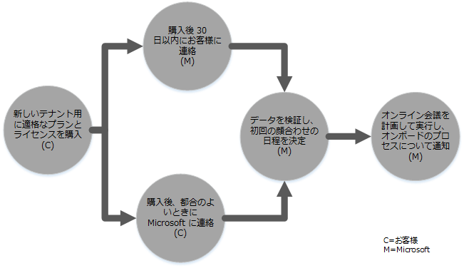
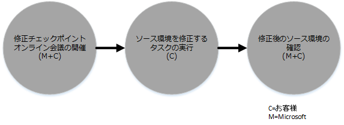
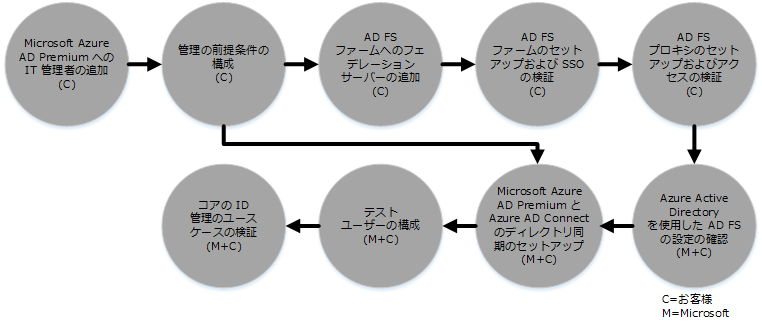

# Azure Rights Management 用 FastTrack センター特典プロセス
組織が Azure Rights Management 用 FastTrack センター特典の対象である場合は、遠隔地の Microsoft のスペシャリストと一緒に Azure RMS 環境を使い始められるように整えることができます。 組織が特典を受ける対象であるかどうかを判断するには、「[Azure Rights Management 用 FastTrack センター特典](../Topic/FastTrack_Center_Benefit_for_Azure_Rights_Management.md)」を参照してください。

この記事には以下が含まれています。

-   [Overview of the onboarding process](#overview_rms)

-   [Expectations for your source environment](#expectations_src_environ_rms)

-   [Phases of the onboarding process](#phases_onboarding_process_rms)

-   各フェーズの [Microsoft responsibilities](#microsoft_responsibilities_rms)

-   各フェーズの [Your responsibilities](#your_responsibilities_rms)

オンボーディングを終えると、次のような状態になっているはずです。

-   Microsoft Azure RMS テナントが作成されている。

-   ライセンスを持つユーザーが、以下のいずれかの ID オプションを使用して Azure RMS サービスにアクセスできる。

    -   クラウド ID (固有の Microsoft Azure AD アカウント)。

    -   同期された ID: Active Directory フォレストを 1 つまたは複数お持ちのお客様に対して Azure Active Directory Connect (Azure AD Connect) ツールでオンプレミスの Active Directory から同期された Microsoft Azure AD アカウント。

    -   フェデレーション ID -- Microsoft Azure AD アカウントが次に該当する場合:

        -   Active Directory フォレスト構成を 1 つ所有するお客様に対して Microsoft Azure Active Directory Connect ツールで Active Directory から同期されている。

        -   オンプレミス Active Directory から Active Directory フェデレーション サービス (AD FS) 2.0 によりフェデレーションされている。

## オンボーディング プロセスの概要
オンボーディングには 2 つの主な構成要素があります。

-   **コア機能** - テナント構成と Azure AD の統合 (必要な場合) に必要なタスク。 コア機能は、他の Microsoft Online 対象のサービスのオンボーディングのベースラインも提供します。

-   **サービス オンボーディング** - Azure RMS スタンドアロンの構成に必要な、あるいは Azure AD Connect ディレクトリ同期または AD FS が伴うタスク。

次の図に、FastTrack センター特典を使用する場合のタイムラインを示します。

基本のプロセスは次のようになっています。

-   Microsoft は、対象となるプランの購入日から 30 日以内にお客様にご連絡します。 これらのサービスを組織で展開する準備ができている場合は、[FastTrack センター](http://fasttrack.microsoft.com/)からサポートをご依頼いただくこともできます。 サポートを依頼するには、FastTrack センター (http://fasttrack.microsoft.com) にサインインしてダッシュ ボードを開き、会社名を選択して [プラン] タブをクリックし、対象サービスのサポート依頼ボタンをクリックしてください。

-   Microsoft チームはコア機能に関して各種のお手伝いをし、その後対象のサービスごとに 1 回オンボーディングを行います。

すべてのオンボーディング サポートは Microsoft の専任担当者から遠隔で提供されます。

-   Microsoft は、ツール、説明書、およびガイダンスを組み合わせて使用したさまざまなオンボーディング活動でお客様を遠隔から支援します。 特定の構成タスクを Microsoft にまかせる場合、そのタスクを実行するためのアクセス許可を Microsoft に提供するように選択してください。

-   オンボーディング サポートは FastTrack センターによって提供され、所定地域の通常業務時間内にご利用いただけます。

-   オンボーディング サポートは、繁体中国語、英語、フランス語、ドイツ語、イタリア語、日本語、ポルトガル語 (ブラジル)、またはスペイン語で利用可能です。

-   Microsoft チームは、お客様の指定に従い、お客様またはお客様の担当者と直接一緒に作業します。

## ソース環境の要件
1 つのコンソールから豊富な機能を持つ ID 管理を活用するために Microsoft Azure Active Directory と統合するオンプレミス Microsoft Active Directory をソース環境に用意しています。 FastTrack センター特典には、既存のオンプレミス実装と Microsoft Azure Active Directory の統合に関する支援が含まれます。 統合が必要な場合、お客様のソース環境が対象のアプリケーションに必要な最低要件を満たしている必要があります。

次の表に、オンボーディングで既存のソース環境に必要とされる要件を示します。

|アクティビティ|ソース環境要件|
|-----------|-----------|
|コア機能|以下のフォレスト構成で、機能フォレスト レベルが Windows Server 2008 以降に設定された Active Directory フォレスト。  -   1 つの Active Directory フォレスト -   複数の Active Directory フォレスト **Note:** フォレストが複数あるすべての構成において、AD FS の展開はFastTrack センター特典の対象外です。|
|サービス オンボーディング  -   Azure RMS|Azure RMS に対してオンプレミスの Active Directory と環境が用意されています。これには、Azure AD と Azure RMS の機能の統合を妨げる特定された問題の修復も含まれます。|

## オンボーディング プロセスのフェーズ
Azure RMS オンボーディングには、次の図にある 5 つのプライマリ フェーズがあります。

-   開始

-   評価

-   修復

-   有効化

-   閉じる

各フェーズの詳細な作業については、「[Microsoft responsibilities](#microsoft_responsibilities_rms)」および「[Your responsibilities](#your_responsibilities_rms)」 のセクションを参照してください。

### 開始フェーズ
適切な数のライセンスを購入した後、購入確認メールのガイダンスに従って、ライセンスを既存または新規のテナントに関連付けます。 Microsoft はお客様が FastTrack センター特典の対象かどうかを確認します。 Microsoft は、対象となるプランの購入日から 30 日以内にお客様にご連絡します。 これらのサービスを組織で展開する準備ができている場合は、[FastTrack センター](http://fasttrack.microsoft.com/)からサポートをご依頼いただくこともできます。 サポートを依頼するには、FastTrack センター (http://fasttrack.microsoft.com) にサインインしてダッシュ ボードを開き、会社名を選択して [プラン] タブをクリックし、対象サービスのサポート依頼ボタンをクリックしてください。

このフェーズで、お客様といっしょにオンボーディング プロセスについて話し合い、データを検証し、キックオフ ミーティングの日付を設定します。

### 評価フェーズ
オンボーディング プロセスが開始すると、Microsoft はお客様といっしょにソース環境および要件を評価します。 ツールを実行してデータを収集した後、Microsoft はオンプレミス Active Directory、インターネット ブラウザー、クライアント デバイスのオペレーティング システム、DNS、ネットワーク、インフラストラクチャ、および ID システムを評価して、オンボーディングを行うために変更の必要があるかどうかを判断します。 現在のセットアップ環境に基づいて、ご使用のソース環境を Azure RMS へと正常にオンボーディングするために必要な最低要件を満たすような修復プランを提供します。 また、修復フェーズのための適切なチェックポイント電話会議を設定します。

### 修復フェーズ
必要であれば、ソース環境で修復プランの作業を行い、各サービスのオンボーディングを行うための要件を満たすことができます。

有効化フェーズを開始する前に、修復アクティビティの結果をいっしょに検証して、先に進む準備ができているかを確認します。

### 有効化フェーズ
すべての修復アクティビティが完了すると、プロジェクトはサービス利用のためのコア インフラストラクチャの構成および Azure RMS のプロビジョニングへとシフトします。

**有効化フェーズ - コア機能**

コア機能の有効化には、サービスのプロビジョニングおよびテナントと ID の統合が含まれます。 また、Microsoft Azure RMS をオンボーディングするための基礎を据えるステップも含まれます。

Azure RMS をオンボーディングする作業は、コア オンボーディングを終えてから開始できます。

**有効化フェーズ – Azure RMS**

Azure RMS 環境は、必要に応じて、Azure AD Connect ディレクトリ同期と Active Directory フェデレーション サービス (AD FS) を使用してセットアップできます。

オンプレミス ID をクラウドに同期する Azure RMS シナリオの場合、IT 管理者とユーザーのサブスクリプションへの追加、管理前提条件の構成、Azure RMS の設定、Azure AD Connect によるディレクトリ同期の設定、Azure AD Connect による Active Directory フェデレーション サービスの設定、テスト ユーザーの構成、サービスのコア ユース ケースの検証を Microsoft が支援します。

Azure RMS 設定では、次の機能を有効にします。

-   RMS サービスの有効化

-   Exchange Online と Sharepoint Online の IRM 構成

-   オンプレミスの Exchange およびオンプレミスの Sharepoint との Rights Management コネクタ

-   Windows デバイスおよび Windows 以外のデバイス用の RMS 共有アプリケーション

## Microsoft の責任

### 全般

-   必要な構成アクティビティのための遠隔サポート アシスタンスを提供します。その内容には、フェーズの説明に記載されています。

-   構成タスクを軽減または省略するために、利用可能な説明書およびソフトウェア ツール、管理コンソール、およびスクリプトを提供します。

FastTrack センター特典を利用するために Microsoft にアクセス許可を与える必要はありません。 場合によっては、Microsoft にアクセス許可を与え、特定の操作を代わりに実行させることができます。

### 開始フェーズ

-   新規テナントの対象ライセンスのご購入から 30 日以内にご連絡します。

-   オンボーディングする対象のサービスを選定します。

### 評価フェーズ

-   管理上の概要を示します。

-   次の点に関してガイダンスを提供します。

    -   DNS、ネットワーク、およびインフラストラクチャのニーズ。

    -   クライアントのニーズ (インターネット ブラウザー、クライアント オペレーティング システム、およびサービスのニーズ)。

    -   ユーザー ID およびプロビジョニング。

    -   ディレクトリ同期の識別要件。

    -   購入済みでオンボーディングの一部として規定されている対象サービスの有効化。

    -   必要なパイロット テストおよびテスト環境の要件の特定。

-   修復アクティビティのタイムラインの設定。

-   修復チェックリストの提供。

### 修復フェーズ

-   修復アクティビティの進捗状況を確認するために、あらかじめ合意したスケジュールに従って電話会議を行います。

-   問題を特定および修復するツールの実行、およびその結果の分析を支援します。

### 有効化フェーズ
次の点に関するガイダンスを行います。

-   Azure RMS テナントのアクティブ化。

-   ファイアウォール ポートの構成。

-   対象サービスの DNS の構成。

-   Azure RMS サービスへの接続の検証。

-   フォレスト環境が 1 つの場合：

    -   Active Directory ドメイン サービス (AD DS) と Azure AD Connect との間のディレクトリ同期サーバーの設置 (必要な場合)。

    -   Azure AD Connect ツールを使用したパスワード同期の構成。

-   複数のフォレスト環境の場合:

    -   Azure AD Connect 同期のインストールと複数フォレストのシナリオのための設定。 パスワード ハッシュ同期とパスワード書き戻しは複数のフォレストに対応しています。  ただし、その他の書き戻しシナリオはサポートされていません。

    -   オンプレミスの Active Directory フォレストと Microsoft Azure AD ディレクトリ (Azure Active Directory) の間の同期の構成。

        > [!NOTE]
        > カスタム ルール拡張機能の開発と実装は対象外です。

-   フォレストが 1 つで、フェデレーション ID を対象とする場合:単一サイトのフォールト トレラント構成における Microsoft Azure AD を使用したローカル ドメイン認証用の Active Directory フェデレーション サービス (AD FS) のインストールおよび構成 (必要な場合)。

    > [!NOTE]
    > フォレストが複数あるすべての構成において、AD FS の展開は対象外です。

-   シングル サインオン (SSO) 機能のテスト (展開されている場合)。

-   テンプレートを管理する情報セキュリティ管理者の追加。

-   Azure RMS へのスーパー ユーザー アカウントの割り当て。

-   Azure RMS の 2 人のパイロット ユーザーのライセンシング。

-   ポリシーを検証するための 2 つのテスト配布グループの構成。

-   ディレクトリ用の 1 つのカスタム Azure RMS テンプレートの構成。

-   次を含む、Azure RMS との SharePoint Online および Exchange Online の統合の設定に関するガイダンス。

    -   Azure RMS と Exchange Online の統合の構成および検証。

    -   組織外の受信者に送信する機密性の高いメッセージを暗号化する 1 つのテスト メール フロー ルールの設定。

    -   Azure RMS で保護する 1 つのテスト ライブラリの SharePoint Online 保護の構成および検証。

-   RMS コネクタを使用した 1 台のオンプレミス サーバーの構成 (適用対象となる場合)。

    -   Azure RMS とオンプレミスの Exchange 2013/2010 の統合の構成および検証。

    -   コネクタを使用した組織外の受信者に送信する機密性の高いメッセージを暗号化する 1 つのテスト メール フロー ルールの設定。

    -   Azure RMS で保護する 1 つのテスト ライブラリのオンプレミスの SharePoint 2013/2010 保護の構成および検証。

-   Windows デバイスおよび Windows 以外のデバイス用の RMS 共有アプリケーションの設定。

## お客様の責任
このセクションでは、オンボーディング プロセス中のお客様の責任について、その一部を説明します。

### 全般

-   この記事に記載されている構成可能なオプション以上の、Azure RMS テナントへの機能拡張や統合。

-   お客様のリソースのプログラムおよびプロジェクトの全般的な管理。

-   エンドユーザー コミュニケーション、資料、トレーニング、および変更管理。

-   ヘルプデスクの資料とトレーニング。

-   組織専用のレポート、プレゼンテーション、または会議議事録の作成。

-   組織専用のアーキテクチャおよび技術に関する資料の作成。

-   ハードウェアおよびネットワークの設計、調達、設置、および構成。

-   ソフトウェアの調達、インストール、および構成。

-   Azure RMS サービスの基準構成と機能をテストするために作成されたもの以外のセキュリティ ポリシーの管理、構成、および適用。

-   Azure RMS サービスの基準構成と機能をテストするために使用するもの以外のユーザー アカウントの登録。

-   ネットワーク構成、分析、帯域幅検証、テスト、およびモニター。

-   技術的な変更管理承認プロセスの管理およびサポート用資料の作成。

-   運営モデルと運営ガイドの変更。

-   お客様が以前に使用したソースの環境とサービスの使用停止と削除。

-   テスト環境の構築と維持。

-   インフラストラクチャ サーバーでの Service Pack および他の必須の更新のインストール。

-   公開 SSL 証明書の提供および構成。

-   エンド ユーザーが所有するデバイスで構成し、表示する、組織の使用条件 (TOU) のステートメントの記述。

### 開始フェーズ

-   Microsoft チームと協力して、対象となるサービスのオンボーディングを開始します。

-   契約キックオフ ミーティングに参加し、組織からの参加者をとりまとめて指導し、修復のタイムラインを確定します。

### 評価フェーズ

-   適切な関係者 (プロジェクト マネージャを含む) を任命して、必要な評価アクティビティを完了させます。

-   希望する場合は、環境または Azure RMS サブスクリプションに対して評価ツールを実行するときにガイダンスが必要であれば、Microsoft と画面を共有します。

-   修復チェックリストを作成し、インフラストラクチャ、ネットワーク、管理、ディレクトリ同期準備、ネットワーク セキュリティ、およびフェデレーション ID などのトピックを含む全体的な計画を策定する会議に参加します。

-   ユーザー プロビジョニング アプローチの概略を決める会議に参加します。

-   オンライン サービス構成を計画する会議に参加します。

-   迅速に移行するためのサポート計画を作成します。

### 修復フェーズ

-   評価フェーズによって明確にされた修復アクティビティを完了するために必要なステップを実行します。

-   チェックポイント会議に参加します。

### 有効化フェーズ

-   希望する場合は、環境または Azure RMS サブスクリプションに対して変更を実行するときにガイダンスが必要であれば、Microsoft と画面を共有します。

-   必要に応じてリソースを管理します。

-   Microsoft のガイダンスによって示されたとおりに、ネットワーク関連の項目を構成します。

-   Microsoft のガイダンスによって示されたとおりに、ディレクトリの準備を行って、ディレクトリ同期を構成します。

-   Microsoft のガイダンスによって示されたとおりに、セキュリティ関連のインフラストラクチャ (ファイアウォール ポートなど) を構成します。

-   適切なクライアント インフラストラクチャを実装します。

-   Microsoft のガイダンスによって示されたとおりに、ユーザー プロビジョニングのアプローチを実装します。

-   Microsoft のガイダンスによって示されたとおりに、各種サービスを有効化します。

## 詳細な情報をご希望ですか?
「[Microsoft Azure Rights Management](http://products.office.com/business/microsoft-azure-rights-management)」と「[Enterprise Mobility Suite](http://www.microsoft.com/en-us/server-cloud/products/enterprise-mobility-suite/default.aspx)」を参照してください。

