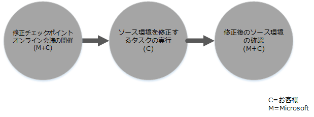

# Intune 用の FastTrack センター特典プロセス
組織が Microsoft Intune サービス特典の対象である場合は、遠隔地の Microsoft のスペシャリストといっしょに Microsoft Intune 環境を使い始められるように整えることができます。

Microsoft Intune は、Microsoft の Enterprise Mobility Suite (EMS) の一部であり、モバイル デバイス管理 (MDM) およびモバイル アプリケーション管理 (MAM) など、エンタープライズ モビリティ管理 (EMM) 機能を提供します。  Microsoft Intune を使用して、デバイスのプロビジョニング、デバイスの構成およびモバイル アプリの展開を行うことで、モバイル デバイスで従業員の生産性を向上させることができます。  さらに Microsoft Intune を使用して、デバイスのポリシー準拠のモニター、モバイル アプリケーションとデータの保護、およびアクセスを制御する Azure AD と会社のサービスとの統合を行うことで、会社のデータを保護できます。

組織が特典を受ける対象であるかどうかを判断するには、「[Intune 用 FastTrack センターの特典](../Topic/FastTrack_Center_Benefit_for_Intune.md)」をご参照ください。 ご自身の環境でこれ以外の Enterprise Mobility Suite サービスを利用するための準備に関心をお持ちの場合には、「[Enterprise Mobility Suite 用の FastTrack センター特典](../Topic/FastTrack_Center_Benefit_for_Enterprise_Mobility_Suite.md)」をご参照ください。

**Microsoft FastTrack for Office 365 に関する情報をお探しですか。「** [Office 365 用 FastTrack センターの特典](https://technet.microsoft.com/library/office-365-onboarding-benefit.aspx)」を参照してください。

この記事では、Microsoft Intune のサービス特典に関する次の情報を提供します。

-   [Overview of the onboarding process](#overview_onboarding_process)

-   [Expectations for your source environment](#expectations_src_environ)

-   [Phases of the onboarding process](#phases_onboarding_process)

-   各フェーズの [Microsoft responsibilities](#microsoft_responsibilities)

-   各フェーズの [Your responsibilities](#your_responsibilities)

オンボーディングを終えると、次のような状態になっているはずです。

-   Microsoft Online Service テナントが作成されている。

-   ライセンスを持つユーザーが、以下のいずれかの ID オプションを使用して Microsoft Intune サービスにアクセスできる。

    -   クラウド ID (固有の Microsoft Online Service アカウント)。

    -   同期された ID: Azure Active Directory Connect (同期サービス) でオンプレミス Active Directory から同期された Microsoft Intune アカウント:

        -   1 つの Active Directory フォレスト環境を所有するお客様向け。

        -   複数フォレスト Active Directory トポロジーのサポートを所有するお客様向け。

-   フェデレーション ID -- Microsoft Intune アカウント:

    -   1 つの Active Directory フォレスト構成を所有するお客様または 1 つの Active Directory アカウント フォレスト (別名「ログオン フォレスト」) および 1 つの Active Directory リソース フォレスト構成を所有するお客様の Microsoft Azure Active Directory Connect ツールにより Active Directory から同期。

    -   オンプレミス Active Directory から Windows Server 2012 R2 Active Directory フェデレーション サービスにより連携またはオンプレミス Active Directory から Active Directory Federation Services (AD FS) 2.0 以降により連携。

## オンボーディング プロセスの概要
オンボーディングには 2 つの主な構成要素があります。

-   **コア機能** - テナント構成と Azure AD の統合 (必要な場合) に必要なタスク。 このコア機能という構成要素は、他の対象のサービスのオンボーディングのベースラインになるものでもあります。

-   **サービス オンボーディング** - Microsoft Intune を構成するために必要なタスク。

次の図に、FastTrack センター特典を使用する場合のイベントの順序を示します。

基本のプロセスは次のようになっています。

-   FastTrack センター は、対象となるプランの購入日から 30 日以内にお客様にご連絡します。 これらのサービスを組織で展開する準備ができている場合は、[FastTrack センター](http://fasttrack.microsoft.com/)からサポートをご依頼いただくこともできます。 サポートを依頼するには、[FastTrack センター](http://fasttrack.microsoft.com/)にサインインしてダッシュボードを開き、会社名を選択して [プラン] タブをクリックし、Microsoft Intune、Azure Active Directory Premium、または Azure Rights Management Premium のサポートを依頼するための [サポート依頼] ボタンをクリックしてしてください。

-   FastTrack センターはコア機能に関して各種のお手伝いをし、その後対象のサービスごとに 1 回オンボーディングを行います。

すべてのオンボーディング サポートは Microsoft の専任担当者から遠隔で提供されます。

-   Microsoft は、ツール、説明書、およびガイダンスを組み合わせて使用したさまざまなオンボーディング活動でお客様を遠隔から支援します。

-   オンボーディング サポートは FastTrack センターによって提供され、所定地域の通常業務時間内にご利用いただけます。

-   オンボーディング サポートは、繁体中国語、英語、フランス語、ドイツ語、イタリア語、日本語、ポルトガル語 (ブラジル)、またはスペイン語で利用可能です。

-   Microsoft チームはお客様またはお客様の担当者と直接一緒に作業します。

## ソース環境の要件
お客様のソース環境には Microsoft Intune サービスへの移行または Microsoft Intune サービスとの統合を希望しているサービスがすでにあるかもしれません 一部のサービスについては、お客様のソース環境との一定レベルの統合セットアップの支援が Intune のFastTrack センター特典に含まれています。 統合が必要な場合、お客様のソース環境が対象のアプリケーションに必要な最低要件を満たしている必要があります。

次の表に、オンボーディングで既存のソース環境に必要とされる要件を示します。

|アクティビティ|ソース環境要件|
|-----------|-----------|
|コア機能|以下のフォレスト構成で、機能フォレスト レベルが Windows Server 2008 以降に設定された Active Directory フォレスト。  -   1 つの Active Directory フォレスト -   複数の Active Directory フォレスト **Note:** フォレストが複数あるすべての構成において、AD FS の展開は FastTrack センター特典の対象外です。|
|サービス オンボーディング  -   Microsoft Intune -   System Center Configuration Manager と統合された Microsoft Intune|Microsoft Intune に接続された System Center Configuration Manager 2012 R2 またはそれ以降のバージョンを使用してデバイスを管理する場合、IT 管理者は、「[管理者チェックリスト:Microsoft Intune を使用してモバイル デバイスを管理するように Configuration Manager を構成する](https://technet.microsoft.com/library/jj943763.aspx)」に従う必要があります。 **Note:** サービス特典には、System Center Configuration Manager の設定または System Center Configuration Manager と統合された Microsoft Intune に必要な最低要件へのアップグレードのサポートは含まれません。|

## オンボーディング プロセスのフェーズ
オンボーディングには 4 つの主なフェーズがあります。

-   開始

-   評価

-   修復

-   有効化

各フェーズの詳細な作業については、「[Microsoft responsibilities](#microsoft_responsibilities)」および「[Your responsibilities](#your_responsibilities)」 のセクションを参照してください。

### 開始フェーズ
適切な数とタイプのライセンスを購入した後、購入確認メールのガイダンスに従って、ライセンスを既存または新規のテナントに関連付けます。 FastTrack センターはお客様がサービス特典の対象かどうかを確認します。 Microsoft は、対象となるプランの購入日から 30 日以内にお客様にご連絡します。 これらのサービスを組織で展開する準備ができている場合は、[FastTrack センター](http://fasttrack.microsoft.com/)からサポートをご依頼いただくこともできます。 サポートを依頼するには、[FastTrack センター](http://fasttrack.microsoft.com/)にサインインしてダッシュボードを開き、会社名を選択して [プラン] タブをクリックし、Microsoft Intune、Azure Active Directory Premium、または Azure Rights Management Premium のサポートを依頼するための [サポート依頼] ボタンをクリックしてしてください。

このフェーズで、お客様といっしょにオンボーディング プロセスについて話し合い、データを検証し、キックオフ ミーティングの日付を設定します。

### 評価フェーズ
オンボーディング プロセスが開始すると、Microsoft はお客様といっしょにソース環境および要件を評価します。 ツールを実行してデータを収集した後、Microsoft はインターネット ブラウザー、クライアント オペレーティング システム、DNS、ネットワーク、インフラストラクチャ、および ID システムを評価して、オンボーディングを行うために変更の必要があるかどうかを判断します。 現在のセットアップ環境に基づいて、ご使用のソース環境を Microsoft Intune へと正常にオンボーディングするために必要な最低要件を満たすような修復プランを提供します。 また、修復フェーズのための適切なチェックポイント電話会議を設定します。

### 修復フェーズ
必要であれば、ソース環境で修復プランの作業を行い、各サービスのオンボーディングを行うための要件を満たすことができます。

有効化フェーズを開始する前に、修復アクティビティの結果をいっしょに検証して、先に進む準備ができているかを確認します。

### 有効化フェーズ
すべての修復アクティビティが完了すると、プロジェクトはサービス利用のためのコア インフラストラクチャの構成および Microsoft Intune のプロビジョニングへとシフトします。

**有効化フェーズ - コア機能**

コア機能の有効化には、サービスのプロビジョニングおよびテナントと ID の統合が含まれます。 また、Microsoft Intune をオンボーディングするための基礎を据えるステップも含まれます。

Microsoft Intune をオンボーディングする作業は、コア機能の有効化を終えてから開始できます。

**有効化フェーズ – Microsoft Intune**

Microsoft Intune の場合、モバイル デバイスとモバイル アプリケーション管理のニーズに基づき、Microsoft Intune を使用してデバイスを管理できるようにする手順をご案内します。 そのために行う実際のステップは、ご使用のソース環境によって異なりますが、一般に以下の作業が含まれます。

-   エンド ユーザーのライセンシング。 必要に応じて、Microsoft クラウド サービス テナントのボリューム ライセンスをアクティブ化する方法のサポートも提供します。

-   オンプレミスの Active Directory ID またはクラウド ID のいずれかを活用した、Microsoft Intune で使用される ID の構成。

-   Microsoft Intune サブスクリプションへのユーザーの追加、IT 管理者ロールの定義、およびユーザーとデバイスのグループの作成。

-   管理ニーズに基づいたモバイル デバイス管理機関の構成:

    -   Microsoft Intune が唯一の MDM ソリューションであるか、Office 365 のモバイル デバイス管理と併用される場合は、Microsoft Intune を MDM 機関として設定します。

    -   System Center Configuration Manager の既存の実装があり、Microsoft Intune を使用した管理機能を拡張しようとする場合は、Configuration Manager を MDM 機関として設定します。

        > [!NOTE]
        > エンドユーザー所有のデバイス、共有デバイス、またはキオスク型デバイス全体でモバイル アプリケーション管理のみを活用しようとする場合は、MDM 機関を設定する必要はありません。

-   モバイル デバイス管理がスコープ内にある場合は、次の点に関してガイダンスを提供します。

    -   MDM 管理ポリシーの検証に使用するテスト グループの構成。

    -   次のような MDM 管理ポリシーとサービスの構成。

        -   Web リンクまたはディープ リンクでサポートされているプラットフォームごとのアプリケーション展開。

        -   条件付きアクセス ポリシー。

        -   電子メール プロファイルの展開。

        -   適用対象となる場合の Microsoft Intune Exchange Connector の設定。

    -   [サポートされているプラットフォーム](https://technet.microsoft.com/library/dn600287.aspx)ごとに最大 2 つのテスト デバイスを Microsoft Intune サービスで Microsoft Intune または Configuration Manager に登録。

    -   ソフトウェアとハードウェアのインベントリ レポートの使用。

-   モバイル アプリケーション管理 (MAM) がスコープ内にある場合、または MAM ポリシーで既存の Microsoft ソリューションまたはサードパーティ製 MDM ソリューションを補完しようとする場合は、次の点に関するガイダンスを提供します。

    -   サポートされているプラットフォームごとの MAM ポリシーの構成。

    -   管理対象アプリの条件付きアクセス ポリシーの構成。

    -   上記の MAM ポリシーを使用した適切なユーザー グループのターゲット設定。

    -   マネージ アプリケーションの使用状況レポートの使用。

-   PC 管理がスコープ内にある場合は、次の点に関してガイダンスを提供します。

    -   必要に応じた Intune クライアント ソフトウェアのインストール。

    -   Intune で利用できるソフトウェアとハードウェアのレポートの使用。

## Microsoft の責任
このセクションでは、オンボーディング プロセス中の Microsoft の責任について、その一部を説明します。

### 全般

-   必要な構成アクティビティのための遠隔サポート アシスタンスを提供します。その内容については、フェーズの詳細な説明で一覧表示しています。

-   構成タスクを軽減または省略するために、利用可能な説明書およびソフトウェア ツール、管理コンソール、およびスクリプトを提供します。

### 開始フェーズ

-   新規テナントの対象ライセンスのご購入から 30 日以内にご連絡します。

-   お客様と連携してオンボーディングを開始します。

-   オンボーディングする対象のサービスを選定します。

### 評価フェーズ

-   管理上の概要を示します。

-   次の点に関するガイダンスを行います。

    -   DNS、ネットワーク、およびインフラストラクチャのニーズ。

    -   クライアントのニーズ (インターネット ブラウザー、クライアント オペレーティング システム、およびサービスのニーズ)。

    -   ユーザー ID およびプロビジョニング。

    -   購入済みでオンボーディングの一部として規定されている対象サービスの有効化。

-   修復アクティビティのタイムラインの設定。

-   修復チェックリストの提供。

### 修復フェーズ

-   修復アクティビティの進捗状況を確認するために、あらかじめ合意したスケジュールに従って電話会議を行います。

-   問題を特定および修復するツールの実行、およびその結果の分析を支援します。

### 有効化フェーズ
次の点に関するガイダンスを行います。

-   Microsoft Online Service テナントのアクティブ化。

-   TCP/IP プロトコルとファイアウォール ポートの構成。

-   対象サービスの DNS の構成。

-   Microsoft Online Service への接続の検証。

-   フォレスト環境が 1 つの場合：

    -   Active Directory ドメイン サービス (AD DS) と対象の Microsoft Online Service との間のディレクトリ同期サーバーの設置 (必要な場合)。

    -   Azure Active Directory Connect ツールを使用した Microsoft Intune (Azure Active Directory) へのパスワード同期 (パスワードのハッシュ) の構成。

        > [!NOTE]
        > カスタム ルール拡張機能の開発と実装は対象外です。

-   フォレストが 1 つで、フェデレーション ID を対象とする場合:単一サイトのフォールト トレラント構成における Microsoft Intune を使用したローカル ドメイン認証用に Active Directory フェデレーション サービス (AD FS) のインストールおよび構成 (必要な場合)。

    > [!NOTE]
    > フォレストが複数あるすべての構成において、AD FS の展開は対象外です。

-   シングル サインオン (SSO) 機能のテスト (展開されている場合)。

#### 有効化フェーズ – Microsoft Intune
次の点に関してガイダンスを提供します。

-   エンド ユーザーのライセンシング。 必要に応じて、Microsoft クラウド サービス テナントのボリューム ライセンスをアクティブ化する方法のサポートも提供します。

-   オンプレミスの Active Directory ID またはクラウド ID のいずれかを活用した、Microsoft Intune で使用される ID の構成。

-   Microsoft Intune サブスクリプションへのユーザーの追加、IT 管理者ロールの定義、およびユーザーとデバイスのグループの作成。

-   管理ニーズに基づいたモバイル デバイス管理機関の構成:

    -   Microsoft Intune が唯一の MDM ソリューションであるか、Office 365 のモバイル デバイス管理と併用される場合は、Microsoft Intune を MDM 機関として設定します。

    -   System Center Configuration Manager の既存の実装があり、Microsoft Intune を使用した管理機能を拡張しようとする場合は、Configuration Manager を MDM 機関として設定します。

        > [!NOTE]
        > エンドユーザー所有のデバイス、共有デバイス、またはキオスク型デバイス全体でモバイル アプリケーション管理のみを活用しようとする場合は、MDM 機関を設定する必要はありません。

-   モバイル デバイス管理がスコープ内にある場合は、次の点に関してガイダンスを提供します。

    -   MDM 管理ポリシーの検証に使用するテスト グループの構成。

    -   次のような MDM 管理ポリシーとサービスの構成。

        -   Web リンクまたはディープ リンクでサポートされているプラットフォームごとのアプリケーション展開。

        -   条件付きアクセス ポリシー。

        -   電子メール プロファイルの展開。

        -   適用対象となる場合の Microsoft Intune Exchange Connector の設定。

    -   サポートされているプラットフォームごとに最大 2 つのテスト デバイスを Microsoft Intune サービスで Microsoft Intune または Configuration Manager に登録。

    -   ハードウェアとソフトウェアのインベントリ レポートの使用。

-   モバイル アプリケーション管理 (MAM) がスコープ内にある場合、または MAM ポリシーで既存のサードパーティ製 MDM ソリューションを補完しようとする場合は、次の点に関するガイダンスを提供します。

    -   サポートされているプラットフォームごとの MAM ポリシーの構成。

    -   管理対象アプリの条件付きアクセス ポリシーの構成。

    -   上記の MAM ポリシーを使用した適切なユーザー グループのターゲット設定。

    -   マネージ アプリケーションの使用状況レポートの使用。

-   PC 管理がスコープ内にある場合は、次の点に関してガイダンスを提供します。

    -   必要に応じた Intune クライアント ソフトウェアのインストール。

    -   Intune で利用できるソフトウェアとハードウェアのレポートの使用。

## お客様の責任
このセクションでは、オンボーディング プロセス中のお客様の責任について、その一部を説明します。

### 全般

-   この記事に記載されている構成可能なオプション以上の、Microsoft Online Service テナントへの機能拡張や統合。

-   お客様のリソースのプログラムおよびプロジェクトの全般的な管理。

-   エンドユーザー コミュニケーション、資料、トレーニング、および変更管理。

-   ヘルプデスクの資料とトレーニング。

-   組織専用のレポート、プレゼンテーション、または会議議事録の作成。

-   組織専用のアーキテクチャおよび技術に関する資料の作成。

-   ハードウェアおよびネットワークの設計、調達、設置、および構成。

-   ソフトウェアの調達、インストール、および構成。

-   Microsoft Intune に必要なクライアント ソフトウェアの構成、パッケージ化、および配布。

-   モバイル デバイスのアクティベーション。

-   ネットワーク構成、分析、帯域幅検証、テスト、およびモニター。

-   技術的な変更管理承認プロセスの管理およびサポート用資料の作成。

-   ユーザー、ワークステーション、およびサーバー管理のためのグループ ポリシーの特定と定義。

-   運営モデルと運営ガイドの変更。

-   多要素認証のセットアップ。

-   ソース環境の無効化および削除 (他の PC またはデバイスの管理ソリューションなど)。

-   テスト環境の構築と維持。

-   インフラストラクチャ サーバーでの Service Pack および他の必須の更新のインストール。

-   公開 SSL 証明書の提供および構成。

-   エンド ユーザーによってアクセス可能な Microsoft Intune のポータル サイトに構成して表示する、組織の使用条件 (TOU) のステートメントの記述。

### 開始フェーズ

-   Microsoft チームと協力して、対象となるサービスのオンボーディングを開始します。

-   契約キックオフ ミーティングに参加し、組織からの参加者をとりまとめて指導し、修復のタイムラインを確定します。

### 評価フェーズ

-   適切な関係者 (プロジェクト マネージャを含む) を任命して、必要な評価アクティビティを完了させます。

-   希望する場合は、環境または Microsoft Intune サブスクリプションに対して評価ツールを実行するときにガイダンスが必要であれば、Microsoft と画面を共有します。

-   修復チェックリストを作成し、インフラストラクチャ、ネットワーク、管理、ディレクトリ同期準備、ネットワーク セキュリティ、およびフェデレーション ID などのトピックを含む全体的な計画を策定する会議に参加します。

-   ユーザー プロビジョニング アプローチの概略を決める会議に参加します。

-   オンライン サービス構成を計画する会議に参加します。

-   迅速に移行するためのサポート計画を作成します。

### 修復フェーズ

-   評価フェーズによって明確にされた修復アクティビティを完了するために必要なステップを実行します。

-   チェックポイント会議に参加します。

### 有効化フェーズ

-   希望する場合は、環境または Microsoft Online Service サブスクリプションに対して変更を実行するときにガイダンスが必要であれば、Microsoft と画面を共有します。

-   必要に応じてリソースを管理します。

-   Microsoft のガイダンスによって示されたとおりに、ネットワーク関連の項目を構成します。

-   Microsoft のガイダンスによって示されたとおりに、ディレクトリの準備を行って、ディレクトリ同期を構成します。

-   Microsoft のガイダンスによって示されたとおりに、セキュリティ関連のインフラストラクチャ (ファイアウォール ポートなど) を構成します。

-   適切なクライアント インフラストラクチャを実装します。

-   Microsoft のガイダンスによって示されたとおりに、ユーザー プロビジョニングのアプローチを実装します。

-   Microsoft のガイダンスによって示されたとおりに、各種サービスを有効化します。

-   Microsoft と連携して、オンボーディング開始から 12 か月以内に対象サービスのオンボーディングを完了させます。

-   Microsoft Intune を使用して PC またはモバイル デバイスの管理を有効にしている場合は、Microsoft Intune を通して管理ポリシーを有効にするときにテスト デバイスを使用します。 テスト デバイスが利用できない場合、お客様には、Microsoft Intune の有効化フェーズ中に使用されるデバイスからのすべてのコンテンツをバックアップおよび (必要に応じて) 復元する責任があります。

-   Web リンクまたはディープ リンクで展開できる Microsoft Intune がサポートされている各プラットフォーム用に最大 2 つのアプリケーションを選択します。

-   Microsoft Intune サービスの基準構成および機能をテストするために使用するもの以外のセキュリティ ポリシーを管理、構成、および適用します。

## 詳細な情報をご希望ですか?
「[Microsoft Intune](http://www.microsoft.com/en-us/server-cloud/products/microsoft-intune/default.aspx)」および「[Enterprise Mobility Suite](http://www.microsoft.com/en-us/server-cloud/products/enterprise-mobility-suite/default.aspx)」を参照してください。

